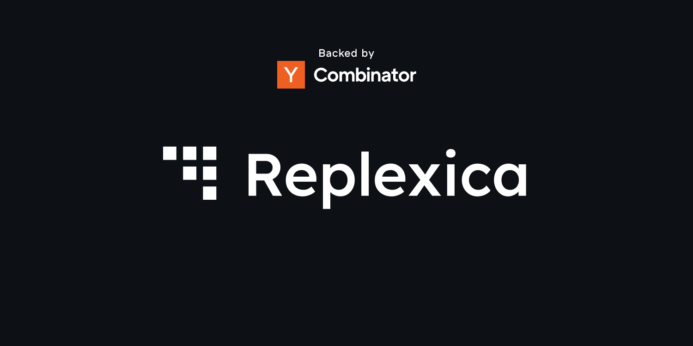
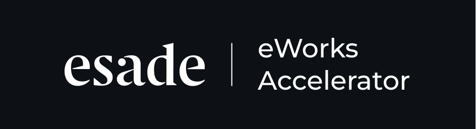

<table width="100%">
    <tr>
        <td colspan="3">
            
        </td>
    </tr>
    <tr>
        <td colspan="3" align="center">
            Supported and backed by
        </td>
    </tr>
    <tr>
        <td width="33%">
            
        </td>
        <td width="33%">
            
        </td>
        <td width="33%">
            
        </td>
    </tr>
</table>

# Replexica

[Website](https://replexica.com) •
[Discord](https://replexica.com/go/discord) •
[Docs](https://replexica.com/go/docs)

Replexica is an i18n platform for React, to ship multi-language apps fast.

Replexica supports React apps, and several i18n formats, including JSON-free, experimental Replexica Compiler format, `.md` files for Markdown content, and classic JSON and YAML-based formats.

Replexica comes with an open-source compiler plugin for React (experimental), and an i18n API in the cloud that performs translations using context-aware LLMs.

## Getting Started

Check out our [Docs](https://replexica.com/docs) for more detailed guides on how to use Replexica with your app.

## What's under the hood

Replexica is a full-stack LLM-powered i18n platform for React, and it consists of **two main parts**:

1. **Replexica i18n Compiler** (this repo, experimental) - an open-source compiler plugin for React:
    * Doesn't require extracting strings into JSON files;
    * Seamlessly integrates with React build system;
    * Infers metadata and user-facing text from the app;
    * Prepares the content for further context-aware translation.

1. **Replexica i18n API** ([replexica.com](https://replexica.com)) - an i18n API in the cloud that translates apps into multiple languages, using LLMs, fast:
    * Full context awareness + brand voice + tone + style + terminology;
    * State-of-the-art quality translations via a mix of open-source and proprietary AI models.

The core idea behind Replexica is simple: it's purpose is to accelerate localization of software.

**The Internet is global, and so must be any software that runs on it.**

## Authors

* **[Veronica](https://github.com/vrcprl)** - Data Science, and LLMs.
* **[Max](https://github.com/maxprilutskiy)** - React, Typescript, and Compilers.

## Community

If you're building a side-project, a startup, or you're working at a big company that uses Replexica - we'd love to hear from you!

* 🌍 Join our [Discord](https://discord.gg/GeK6AuSqzw) and tell us what you like, what you don't like, what you'd like to see next.
* 🌟 Leave a star on our [GitHub](https://github.com/replexica/replexica).
* 🐞 Report bugs with [GitHub Issues](https://github.com/replexica/replexica/issues) and we'll fix them as soon as we physically can.
* 🏗️ If you're a developer, and you'd like to contribute to Replexica, check out our [Contributing Guide](./CONTRIBUTING.md).
